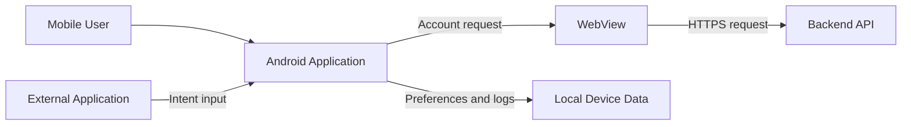

# MobileShield Android Threat Model

## 1. Purpose

This threat model identifies the assets, entry points, trust boundaries, threat actors and abuse scenarios associated with the synthetic MobileShield Android application.

The model supports secure design, vulnerability prioritization and verification of the remediated implementation.

> All application behavior, identities, endpoints and findings are synthetic and intended exclusively for authorized security training.

## 2. System Description

MobileShield represents a simplified Android application that opens an account page inside a WebView.

The vulnerable implementation demonstrates intentionally insecure behavior involving:

- External intent data.
- Hardcoded application secrets.
- Sensitive logging.
- Plaintext local storage.
- Cleartext network traffic.
- Unsafe WebView configuration.
- Weak hashing.
- Insecure manifest settings.
- Excessive Android permissions.

The remediated implementation applies restrictive configuration and removes unnecessary exposure.

## 3. Architecture and Data Flow



## 4. Trust Boundaries

| Boundary | Components | Security Concern |
|---|---|---|
| TB-01 | User or external application to Android activity | Intent data must be treated as untrusted |
| TB-02 | Android application to WebView | Native functionality must not be exposed to untrusted web content |
| TB-03 | WebView to backend API | Traffic requires confidentiality, integrity and server authentication |
| TB-04 | Application process to device storage | Sensitive data requires restricted and protected storage |
| TB-05 | Application process to device logs | Sensitive values must not enter diagnostic output |
| TB-06 | Application package to attacker-controlled analysis tools | Embedded secrets can be recovered from the package |

## 5. Security-Critical Assets

| Asset | Security Requirement | Potential Impact |
|---|---|---|
| Session token | Confidentiality and limited lifetime | Account impersonation |
| API credentials | Confidentiality and server-side protection | Unauthorized API access |
| Account identifier | Integrity and appropriate privacy | Account targeting or manipulation |
| Backend API traffic | Confidentiality, integrity and authenticity | Interception or request modification |
| Android activity | Authorized invocation and validated input | Unauthorized functionality access |
| WebView bridge | Strictly limited native exposure | Native data disclosure |
| Application logs | Exclusion of sensitive data | Credential or privacy leakage |
| Local application data | Protected storage and backup handling | Offline data exposure |
| Release configuration | Debugging and development controls disabled | Runtime inspection and tampering |

## 6. Threat Actors

| Threat Actor | Capability | Objective |
|---|---|---|
| Malicious Android application | Sends intents and interacts with exported components | Invoke unauthorized functionality |
| Network-positioned attacker | Observes or modifies unencrypted traffic | Steal or manipulate application data |
| Device-level attacker | Reviews files, backups and logs | Recover credentials or session data |
| Reverse engineer | Decompiles and inspects the APK | Extract hardcoded values and application logic |
| Malicious web content | Executes inside an unsafe WebView | Access native interfaces or local resources |
| Unauthorized debugger | Attaches runtime inspection tools | Inspect memory and alter application behavior |

## 7. Entry Points

| Entry Point | Input | Trust Level | Primary Threat |
|---|---|---|---|
| Launcher activity | Android intent | Untrusted | Intent manipulation |
| Custom activity action | Account and session extras | Untrusted | Unauthorized component invocation |
| WebView navigation | URL and web content | Untrusted | Malicious content or navigation |
| JavaScript interface | JavaScript method calls | Untrusted | Native session-token disclosure |
| Backend connection | Network responses | External | Interception or content manipulation |
| Local preferences | Locally stored values | Device boundary | Credential recovery |
| Application logs | Runtime diagnostic output | Device boundary | Sensitive-data disclosure |
| Application package | Kotlin bytecode and resources | Public to reverse engineering | Hardcoded-secret extraction |

## 8. STRIDE Threat Analysis

| ID | STRIDE Category | Scenario | Affected Assets | Existing Vulnerable Evidence | Mitigation |
|---|---|---|---|---|---|
| TM-01 | Spoofing | Attacker reuses a disclosed session token | Session token, user account | Token exposed through logs and WebView bridge | Remove exposure and use short-lived server-issued tokens |
| TM-02 | Tampering | Network attacker modifies an HTTP account response | API traffic, WebView content | Cleartext HTTP permitted | Enforce HTTPS and certificate validation |
| TM-03 | Repudiation | Sensitive debug output creates unreliable or uncontrolled evidence | Logs, user activity | Account and session information logged | Use structured non-sensitive security logging |
| TM-04 | Information Disclosure | Reverse engineer extracts the embedded API key | API credential | Hardcoded `API_KEY` | Keep privileged secrets on backend systems |
| TM-05 | Information Disclosure | Device attacker recovers plaintext session data | Session token | Plaintext `SharedPreferences` | Avoid persistence or use Keystore-backed encryption |
| TM-06 | Information Disclosure | Backup includes sensitive application data | Local data | Application backup enabled | Disable or strictly control backup content |
| TM-07 | Information Disclosure | Web content retrieves the session token through native bridge | Session token | `addJavascriptInterface` exposure | Remove the bridge and disable unnecessary JavaScript |
| TM-08 | Elevation of Privilege | External application invokes privileged account flow | Android activity | Unprotected custom exported action | Remove exposure or enforce caller authorization |
| TM-09 | Elevation of Privilege | Malicious WebView content accesses local resources | Local files, application data | File and content access enabled | Disable unnecessary WebView capabilities |
| TM-10 | Tampering | Attacker exploits debug-enabled application behavior | Application process | Debuggable flag enabled | Disable debugging in release configuration |
| TM-11 | Information Disclosure | Excessive permissions expose unnecessary device data | External storage | Read and write permissions requested | Remove permissions not required by functionality |

## 9. Primary Abuse Cases

### AC-01 — Unauthorized Activity Invocation

1. A malicious application identifies the exported MobileShield activity.
2. It sends the custom `OPEN_ACCOUNT` action.
3. It supplies attacker-controlled account and session extras.
4. The vulnerable activity accepts and processes the values.
5. Sensitive values may be stored, logged or passed into the WebView.

**Related findings:** MS-002, MS-003 and MS-005.

**Mitigation:** Remove the unnecessary custom entry point and do not trust externally supplied authentication state.

### AC-02 — Session Disclosure Through WebView

1. The application enables JavaScript.
2. A native bridge containing the session token is registered.
3. Untrusted or modified content executes inside the WebView.
4. JavaScript calls `MobileBridge.getSessionToken()`.
5. The session token is exposed outside the trusted native workflow.

**Related findings:** MS-006 and MS-007.

**Mitigation:** Remove the bridge, disable unnecessary JavaScript and restrict WebView navigation.

### AC-03 — Network Interception

1. The application requests an account page over HTTP.
2. An attacker observes or modifies the cleartext connection.
3. Modified content is returned to the WebView.
4. The content may mislead the user or interact with unsafe WebView features.

**Related findings:** MS-004, MS-006 and MS-007.

**Mitigation:** Enforce HTTPS, reject cleartext traffic and minimize WebView capabilities.

### AC-04 — Offline Credential Recovery

1. An attacker obtains the application package, logs, preferences or backup data.
2. The hardcoded API key is extracted from the package.
3. Session information is recovered from logs or preferences.
4. Recovered values may be reused against application services.

**Related findings:** MS-001, MS-002, MS-003 and MS-009.

**Mitigation:** Keep privileged secrets server-side, remove sensitive logging and avoid unnecessary credential persistence.

## 10. Risk Prioritization

| Priority | Threat Scenarios | Reason |
|---|---|---|
| Immediate | Unauthorized component invocation and WebView session disclosure | Direct paths to unauthorized access or credential exposure |
| Urgent | Hardcoded secrets, sensitive logging, plaintext storage, HTTP, unsafe file access and backups | High likelihood of data or credential disclosure |
| Planned | Weak hashing, debugging and excessive permissions | Security hardening weaknesses that increase attack capability |

## 11. Security Requirements

| ID | Requirement |
|---|---|
| SR-01 | The application must not contain privileged API credentials |
| SR-02 | Authentication and session values must not be written to logs |
| SR-03 | Sensitive values must not be stored without appropriate protection |
| SR-04 | All backend communication must use HTTPS |
| SR-05 | Cleartext network communication must be disabled |
| SR-06 | Exported components must have a documented business requirement |
| SR-07 | External input must not establish authentication state |
| SR-08 | WebViews must disable capabilities not required by the application |
| SR-09 | Sensitive native functionality must not be exposed to JavaScript |
| SR-10 | Security-sensitive hashing must use approved algorithms |
| SR-11 | Sensitive application data must be excluded from backups |
| SR-12 | Debug functionality must be disabled in release builds |
| SR-13 | Android permissions must follow least privilege |

## 12. Implemented Security Controls

| Control | Implementation |
|---|---|
| Secret removal | Embedded API key removed |
| Secure transport | HTTPS endpoint and cleartext prohibition |
| Component reduction | Custom exported action removed |
| Input reduction | External account and session values not consumed |
| Log protection | Sensitive debug logging removed |
| Storage protection | Session and API-key persistence removed |
| WebView hardening | JavaScript, file access and content access disabled |
| Navigation restriction | WebView restricted to expected HTTPS host |
| Cryptographic improvement | MD5 replaced with SHA-256 |
| Backup protection | Application backup disabled |
| Release hardening | Debugging disabled |
| Least privilege | Unnecessary storage permissions removed |

## 13. Validation Strategy

The threat model is connected to executable validation:

```bash
python3 scripts/analyze_findings.py
python3 scripts/validate_remediation.py
python3 -m unittest discover -s tests -v
```

The automated validation confirms:

- Eleven registered findings are present.
- Every finding maps to a remediation check.
- All eleven remediation controls pass.
- Regression tests detect reintroduced HTTP and backup weaknesses.
- Missing security evidence causes validation failure.

## 14. Assumptions and Limitations

The model assumes:

- The Android source represents the complete demonstrated client behavior.
- The API endpoint and application identities are synthetic.
- The remediated example is a reference implementation rather than a production application.
- Backend authentication and authorization are outside the current repository scope.

The current model does not independently evaluate:

- A compiled or signed APK.
- Third-party dependencies.
- Backend APIs.
- Physical-device compromise.
- Root or emulator detection.
- Runtime hooking.
- Actual TLS server configuration.
- Mobile malware behavior.

## 15. Recommended Future Testing

1. Build and inspect a release APK.
2. Run MobSF static and dynamic analysis.
3. Test exported components with ADB.
4. Inspect local storage and backups.
5. Intercept authorized test traffic using a controlled proxy.
6. Test WebView navigation and input validation.
7. Perform dependency and secret scanning.
8. Test the backend API independently.
9. Validate release signing and build configuration.
10. Re-run all remediation regression tests through CI/CD.

## 16. Conclusion

The primary MobileShield risks originate from crossing trust boundaries without sufficient validation or protection.

The most significant attack paths combine exposed Android components, attacker-controlled input, unsafe WebView functionality, insecure network communication and sensitive-data exposure.

The remediated implementation reduces these paths through attack-surface reduction, HTTPS enforcement, WebView hardening, data minimization and automated security regression testing.